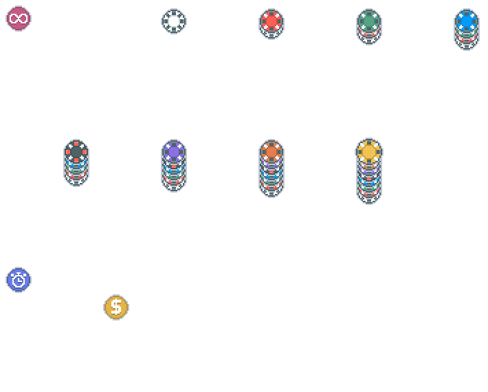

# stackers

This Balatro mod is a small Malverk texture pack that replaces the stake win sticker textures with stacked ones, showing previous stake stickers below them.

## Requirements

- [Malverk](https://malverk.com/) (1.1.4b or later)

## Installation

1. Clone this repository or download it as a ZIP file (green button in the top right)
2. Put it in your `Mods` folder
3. Enable it in `Options > Textures`

## Acknowledgements

- [Eremel](https://github.com/Eremel) for [Malverk](https://malverk.com/)
- [vissa](https://vissa.itch.io) for the textures
- [KliPeH](https://github.com/definitelynotklip) for the idea
- [LasagnaFelidae](https://github.com/LasagnaFelidae) for help
